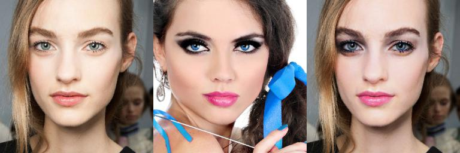
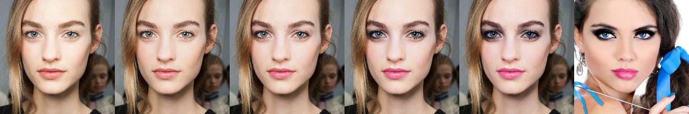
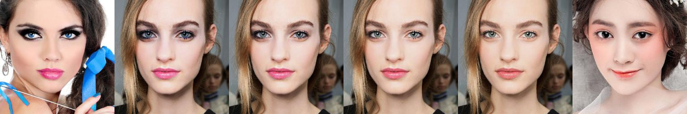
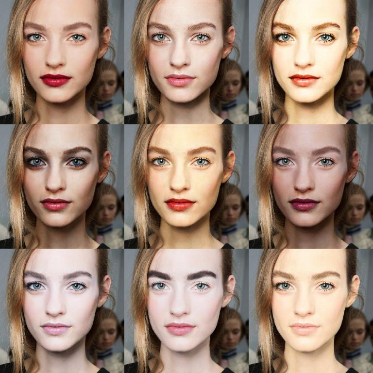

# DMT

TensorFlow implementation of [Disentangled Makeup Transfer with Generative Adversarial Network](https://arxiv.org/abs/1907.01144)

The facial images are disentangled into identity codes and makeup codes to achieve diverse scenarios of makeup transfer

## Results









## Files

- `main.py`: the main code
- `dmt.pb`: the pre-trained model
- `faces`: images of makeup and non-makeup faces
- `output`: the generated images

## Usage

```
python main.py
```

If you want to use other non-makeup or makeup images, set the paths to the target images

```
no_makeup = os.path.join('faces', 'no_makeup', 'xfsy_0055.png')
makeup_a = os.path.join('faces', 'makeup', 'XMY-074.png')
makeup_b = os.path.join('faces', 'makeup', 'vFG112.png')
```